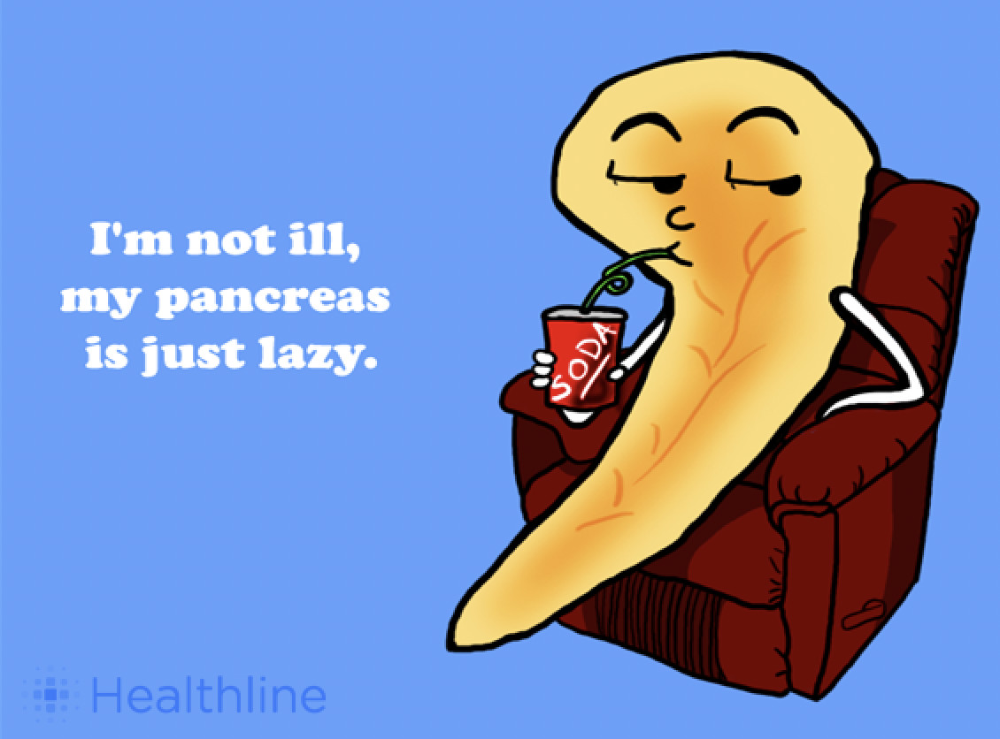

```{r setup, include=FALSE}
knitr::opts_chunk$set(echo = FALSE)

# Learn more about creating blogs with Distill at:
# https://rstudio.github.io/distill/blog.html

library(rio)
library(here)
library(tidyverse)


```


```{r echo=FALSE}

```

**Type 1 Diabetes** is a disease that requires vigilant monitoring and constant medication to make up for the pancreas's lack of ability to produce insulin (a hormone vital to digeting food and turning it into energy). 


People with **type 1 Diabetes** must take **insulin** to live, but if they take too much insulin it results in immediate death. 

**Constant glucose monitors** are a small, wearable machine that allows us to see blood sugar values every 5 minutes. This allows people with type 1 diabetes to aim for blood sugar within a tight range, but it also induces an intense amount of stress and anxiety. 

If blood sugar stays high for too long, it slowly damages organs and causes blindness, amputations, and death. However, if it goes too low it results in seizures, comas, or death. 

There are also values of blood sugar that are higher or lower than what we would see in a healthy body that are not high enough or low enough to be directly life-threatening but they can cause unpleasant symptoms. This study explores those symptoms. There are many components of t1d that are not life-threatening that are still largely impactful and deserve the focus of resarch. 


